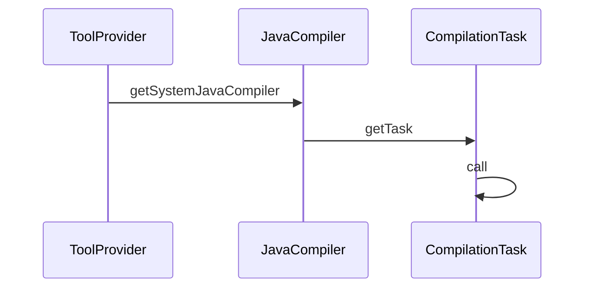

在早期的版本中（ Java SE5 及以前版本）中只能通过 tools.jar 中的 `com.sun.tools.javac` 包来调用Java编译器，但由于 `tools.jar` 不是标准的 Java 库，在使用时必须要设置这个 jar 的路径。而在 Java SE6 中为我们提供了标准的包来操作 Java 编译器，这就是 `javax.tools` 包。

## 编译 Java 文件

使用 Java API 来编译 Java 源代码有非常多方法，目前让我们来看一种最简单的方法，通过 JavaCompiler 进行编译。

使用 `ToolProvider.getSystemJavaCompiler` 来得到一个 `JavaCompiler` 接口的实例。

```java
JavaCompiler compiler = ToolProvider.getSystemJavaCompiler();
```

`JavaCompiler` 中最核心的方法是 `run()`。通过这个方法能编译 Java 源代码。

```java
int run(InputStream in, OutputStream out, OutputStream err, String... arguments)
```

参数分别用来为：

1. Java 编译器提供参数
2. 得到 Java 编译器的输出信息
3. 接收编译器的错误信息，
4. 一个或多个Java源程式文件

如果 run 编译成功，返回 0。

如果前 3 个参数传入的是 `null` ，那么 run 方法将以标准的输入、输出代替，即 `System.in`、`System.out `和 `System.err` 。如果我们要编译一个 `test.java` 文件，并将使用标准输入输出，run 的使用方法如下：

```java
int results = tool.run(null, null, null, "test.java");
```

完整的例子：

```java
// CompileMain.java
package cn.rice.uu.compile.demo2;

import javax.tools.JavaCompiler;
import javax.tools.ToolProvider;
import java.io.BufferedReader;
import java.io.IOException;
import java.io.InputStreamReader;

public class CompileMain {

    public static void main(String[] args) throws IOException {
        JavaCompiler compiler = ToolProvider.getSystemJavaCompiler();
        int result = compiler.run(null, null, null, "C:\\wg\\project\\JetBrains\\IDEA\\Learn\\src\\main\\java\\cn\\rice\\uu\\compile\\demo2\\Test.java");
        System.out.println(result == 0 ? "编译成功" : "编译失败");

        Process process = Runtime.getRuntime().exec("java -classpath C:\\wg\\project\\JetBrains\\IDEA\\Learn\\src\\main\\java cn.rice.uu.compile.demo2.Test");
        BufferedReader bufferedReader = new BufferedReader(new InputStreamReader(process.getInputStream()));
        String str;
        while ((str = bufferedReader.readLine()) != null) {
            System.out.println(str);
        }
    }
}

// Test.java
package cn.rice.uu.compile.demo2;

public class Test {
    public static void main(String[] args) {
        System.out.println("This is test class!");
    }
}
            
// 编译成功
// This is test class!
```

## 编译非文件形式源代码

JDK 6 的编译器 API 的另外一个强大之处在于，它可以编译的源文件的形式并不局限于文本文件。`JavaCompiler` 类依靠文件管理服务可以编译多种形式的源文件。比如直接由内存中的字符串构造的文件，或者是从数据库中取出的文件。这种服务是由 `JavaFileManager` 类提供的。

在 Java SE6 中最佳的方法是使用 `StandardJavaFileManager` 类。这个类能非常好地控制输入、输出，并且能通过 `DiagnosticListener `得到诊断信息，而 `DiagnosticCollector` 类就是 listener 的实现。新的 JDK 定义了 `javax.tools.FileObject` 和 `javax.tools.JavaFileObject` 接口。任何类，只要实现了这个接口，就可以被 `JavaFileManager` 识别。



使用`StandardJavaFileManager`步骤：

1. 建立一个`DiagnosticCollector`实例
2. 通过`JavaCompiler.getStandardFileManager()`方法得到一个`StandardFileManager`对象。
3. 使用`StandardFileManager`获取需要编译的源代码。从文件或者字符流中获取源代码。
4. `JavaCompiler.getTask()`生成编译任务抽象。
5. 通过`CompilationTask.call()`方法编译源代码。
6. 关闭`StandardFileManager`。

在使用这种方法调用 Java 编译时最复杂的方法就是`getTask`，下面让我们讨论一下`getTask`方法。这个方法有如下所示的 6 个参数。

```java
getTask(Writer out,
        JavaFileManager fileManager,
        DiagnosticListener<? super JavaFileObject> diagnosticListener,
        Iterable<String> options,
        Iterable<String> classes,
        Iterable<? extends JavaFileObject> compilationUnits)
```

这些参数大多数都可为`null`。他们的含义所下。

- `out`: 用于输出错误的流，默认是`System.err`。
- `fileManager`:标准的文件管理。
- `diagnosticListener`: 编译器的默认行为。
- `options`: 编译器的选项
- `classes`：参和编译的class。
- `compilationUnits`: 待编译的Java文件，不能为`null`。

`CompilationTask` 提供了 `setProcessors(Iterable<? extends Processor>processors)`方法，用户可以制定处理 annotation 的处理器。

在使用完`getTask`前，需要通过`StandardJavaFileManager.getJavaFileObjectsFromFiles()`或`StandardJavaFileManager.getJavaFileObjectsFromStrings`方法得到待编译的`compilationUnits`对象。

> 也可以通过继承/实现`SimpleJavaObject`获取带编译的对象。

调用这两个方法的方式如下：

```java
Iterable<? extends JavaFileObject> getJavaFileObjectsFromFiles(Iterable<? extends File> files)
Iterable<? extends JavaFileObject> getJavaFileObjectsFromStrings(Iterable<String> names)

String[] filenames = …;
Iterable<? extends JavaFileObject> compilationUnits =
fileManager.getJavaFileObjectsFromFiles(Arrays.asList(filenames));

JavaCompiler.CompilationTask task = compiler.getTask(null, fileManager,
diagnostics, options, null, compilationUnits);
```

最后需要关闭`fileManager.close()`;

例如：

```java
// JavaFileManagerMain.java
package cn.rice.uu.compile.demo2;

import javax.tools.JavaCompiler;
import javax.tools.JavaFileObject;
import javax.tools.StandardJavaFileManager;
import javax.tools.ToolProvider;
import java.io.File;
import java.util.Arrays;
import java.util.regex.Matcher;

public class JavaFileManagerMain {
    public static void main(String[] args) {
        String fullQuanlifiedFileName = "C:\\wg\\project\\JetBrains\\IDEA\\Learn\\src\\main\\java" + ".cn.rice.uu.compile.demo2.".replaceAll("\\.", Matcher.quoteReplacement(File.separator)) + "Calculator.java";
        JavaCompiler compiler = ToolProvider.getSystemJavaCompiler();
        StandardJavaFileManager fileManager =
                compiler.getStandardFileManager(null, null, null);

        Iterable<? extends JavaFileObject> files =
                fileManager.getJavaFileObjectsFromStrings(
                        Arrays.asList(fullQuanlifiedFileName));
        JavaCompiler.CompilationTask task = compiler.getTask(
                null, fileManager, null, null, null, files);

        Boolean result = task.call();
        if (result == true) {
            System.out.println("Succeeded");
        }
    }
}

// Calculator.java
package cn.rice.uu.compile.demo2;

public class Calculator {
    public int multiply(int multiplicand, int multiplier) {
        return multiplicand * multiplier;
    }
}

```

### JavaFileObject 获取 Java 源程序

开发者希望生成 `Calculator` 的一个测试类，而不是手工编写。使用 compiler API，可以将内存中的一段字符串，编译成一个 CLASS 文件。

定制 JavaFileObject 对象：

```java
package cn.rice.uu.compile.demo2;

import javax.tools.SimpleJavaFileObject;
import java.io.IOException;
import java.net.URI;
import java.net.URISyntaxException;

public class StringObject extends SimpleJavaFileObject {
    private String content = null;

    protected StringObject(String className, String contents) throws URISyntaxException {
        super(new URI(className), Kind.SOURCE);
        this.content = contents;
    }

    @Override
    public CharSequence getCharContent(boolean ignoreEncodingErrors) throws IOException {
        return content;
    }
}
```

`SimpleJavaFileObject` 是 `JavaFileObject` 的子类，它提供了默认的实现。继承 `SimpleJavaObject` 之后，只需要实现 `getCharContent` 方法。

接下来，在内存中构造 `Calculator` 的测试类 `CalculatorTest`，并将代表该类的字符串放置到 `StringObject` 中，传递给 `JavaCompiler.getTask` 方法。

具体如下：

```java
package cn.rice.uu.compile.demo2;

import javax.tools.JavaCompiler;
import javax.tools.JavaFileObject;
import javax.tools.StandardJavaFileManager;
import javax.tools.ToolProvider;
import java.io.BufferedReader;
import java.io.IOException;
import java.io.InputStreamReader;
import java.net.URISyntaxException;
import java.util.Arrays;

public class StringClassCompilerMain {
    public static void main(String[] args) {
        JavaCompiler javaCompiler = ToolProvider.getSystemJavaCompiler();
        StandardJavaFileManager standardJavaFileManager = javaCompiler.getStandardFileManager(null, null, null);
        JavaFileObject testFile = generateTest();
        Iterable<? extends JavaFileObject> classes = Arrays.asList(testFile);
        JavaCompiler.CompilationTask task = javaCompiler.getTask(null, standardJavaFileManager, null, null, null, classes);
        if (task.call()) {
            System.out.println("success");
        } else {
            System.out.println("failure!");
        }
        runClass("cn.rice.uu.compile.demo2.CalculatorTest");
    }

    public static void runClass(String className) {
        Process process = null;
        try {
            process = Runtime.getRuntime().exec(className);

            BufferedReader bufferedReader = new BufferedReader(new InputStreamReader(process.getInputStream()));
            String str;
            while ((str = bufferedReader.readLine()) != null) {
                System.out.println(str);
            }
        } catch (IOException e) {
            e.printStackTrace();
        }
    }

    private static JavaFileObject generateTest() {
        String contents = new String(
                "package cn.rice.uu.compile.demo2;" +
                        "class CalculatorTest {\n" +
                        "  public void testMultiply() {\n" +
                        "    Calculator c = new Calculator();\n" +
                        "    System.out.println(c.multiply(2, 4));\n" +
                        "  }\n" +
                        "  public static void main(String[] args) {\n" +
                        "    CalculatorTest ct = new CalculatorTest();\n" +
                        "    ct.testMultiply();\n" +
                        "  }\n" +
                        "}\n");
        StringObject so = null;
        try {
            so = new StringObject("cn.rice.uu.compile.demo2.CalculatorTest", contents);
        } catch (URISyntaxException e) {
            e.printStackTrace();
        }

        return so;

    }
}
```

## 采集编译器的诊断信息

收集编译过程中的诊断信息是 JDK6 新增的内容。诊断信息，通常指错误、警告或是编译过程中的详尽输出。

JDK 6 通过 `Listener` 机制，获取这些信息。如果要注册一个 `DiagnosticListener`，必须使用 `CompilationTask` 来进行编译，因为 `Tool.run` 方法没有办法注册 `Listener`。

步骤:

1. 构造一个 `Listener`；
2. 传递给 `JavaFileManager` 的构造函数；
3. 编译完成后，获取`Diagnostic`列表；
4. 输出诊断信息。

例子：

```java
package cn.rice.uu.compile.demo2;

import javax.tools.*;
import java.net.URISyntaxException;
import java.util.Arrays;
import java.util.List;
import java.util.Locale;

public class StringClassCompilerMainWithListener {
    public static void main(String[] args) {
        JavaCompiler javaCompiler = ToolProvider.getSystemJavaCompiler();
        DiagnosticCollector<JavaFileObject> collector = new DiagnosticCollector<>();
        StandardJavaFileManager standardJavaFileManager = javaCompiler.getStandardFileManager(null, null, null);
        JavaFileObject testFile = generateTest();
        Iterable<? extends JavaFileObject> classes = Arrays.asList(testFile);
        JavaCompiler.CompilationTask task = javaCompiler.getTask(null, standardJavaFileManager, collector, null, null, classes);
        if (task.call()) {
            System.out.println("success");
        } else {
            System.out.println("failure!");
        }

        List<Diagnostic<? extends JavaFileObject>> diagnostics = collector.getDiagnostics();
        for (Diagnostic<? extends JavaFileObject> diagnostic: diagnostics){
            System.out.println("line:"+ diagnostic.getLineNumber());
            System.out.println("msg:"+ diagnostic.getMessage(Locale.ENGLISH));
            System.out.println("source:"+ diagnostic.getSource());

        }
    }

    private static JavaFileObject generateTest() {
        String contents = new String(
                "package cn.rice.uu.compile.demo2;\n" +
                        "class CalculatorTest {\n" +
                        "  public void testMultiply() {\n" +
                        "    Calculator c = new Calculator()\n" +
                        "    System.out.println(c.multiply(2, 4));\n" +
                        "  }\n" +
                        "  public static void main(String[] args) {\n" +
                        "    CalculatorTest ct = new CalculatorTest();\n" +
                        "    ct.testMultiply();\n" +
                        "  }\n" +
                        "}\n");
        StringObject so = null;
        try {
            so = new StringObject("cn.rice.uu.compile.demo2.CalculatorTest", contents);
        } catch (URISyntaxException e) {
            e.printStackTrace();
        }

        return so;

    }
}
```

`generateTest`方法在构造`Calculator`时，将行尾`;`去掉，造成java 源文件错误，在编译时，会输出：

```shell
line:4
msg:需要';'
source:cn.rice.uu.compile.demo2.StringObject[cn.rice.uu.compile.demo2.CalculatorTest]
```

## 运行时编译和运行java类



### CharSequenceJavaFileObject -- 存储源代码

```java
package win.hgfdodo.compiler;

import javax.tools.SimpleJavaFileObject;
import java.io.IOException;
import java.net.URI;

/**
 * 字符串java源代码。JavaFileObject表示
 */
public class CharSequenceJavaFileObject extends SimpleJavaFileObject {

    //表示java源代码
    private CharSequence content;

    protected CharSequenceJavaFileObject(String className, String content) {
        super(URI.create("string:///" + className.replaceAll("\\.", "/") + Kind.SOURCE.extension), Kind.SOURCE);
        this.content = content;
    }

    /**
     * 获取需要编译的源代码
     * @param ignoreEncodingErrors
     * @return
     * @throws IOException
     */
    @Override
    public CharSequence getCharContent(boolean ignoreEncodingErrors) throws IOException {
        return content;
    }
}
```

### JavaClassObject 保存编译结果

```java
package win.hgfdodo.compiler;

import javax.tools.SimpleJavaFileObject;
import java.io.ByteArrayOutputStream;
import java.io.IOException;
import java.io.OutputStream;
import java.net.URI;

/**
 * 存储编译后的字节码
 */
public class JavaClassObject extends SimpleJavaFileObject {

    /**
     * Compiler编译后的byte数据会存在这个ByteArrayOutputStream对象中，
     * 后面可以取出，加载到JVM中。
     */
    private ByteArrayOutputStream byteArrayOutputStream;

    public JavaClassObject(String className, Kind kind) {
        super(URI.create("string:///" + className.replaceAll("\\.", "/") + kind.extension), kind);
        this.byteArrayOutputStream = new ByteArrayOutputStream();
    }

    /**
     * 覆盖父类SimpleJavaFileObject的方法。
     * 该方法提供给编译器结果输出的OutputStream。
     * 
     * 编译器完成编译后，会将编译结果输出到该 OutputStream 中，我们随后需要使用它获取编译结果
     *
     * @return
     * @throws IOException
     */
    @Override
    public OutputStream openOutputStream() throws IOException {
        return this.byteArrayOutputStream;
    }

    /**
     * FileManager会使用该方法获取编译后的byte，然后将类加载到JVM
     */
    public byte[] getBytes() {
        return this.byteArrayOutputStream.toByteArray();
    }
}
```

### JavaFileManager 处理编译结果

JavaFileManager提供了编译结果存储和编译类的加载。

```java
package win.hgfdodo.compiler;

import javax.tools.FileObject;
import javax.tools.ForwardingJavaFileManager;
import javax.tools.JavaFileManager;
import javax.tools.JavaFileObject;
import java.io.IOException;
import java.security.SecureClassLoader;

/**
 * 输出字节码到JavaClassFile
 */
public class ClassFileManager extends ForwardingJavaFileManager {

    /**
     * 存储编译后的代码数据
     */
    private JavaClassObject classJavaFileObject;

    protected ClassFileManager(JavaFileManager fileManager) {
        super(fileManager);
    }

    /**
     * 编译后加载类
     * <p>
     * 返回一个匿名的SecureClassLoader:
     * 加载由JavaCompiler编译后，保存在ClassJavaFileObject中的byte数组。
     */
    @Override
    public ClassLoader getClassLoader(Location location) {
        return new SecureClassLoader() {
            @Override
            protected Class<?> findClass(String name) throws ClassNotFoundException {
                byte[] bytes = classJavaFileObject.getBytes();
                return super.defineClass(name, bytes, 0, bytes.length);
            }
        };
    }

    /**
     * 给编译器提供JavaClassObject，编译器会将编译结果写进去
     */
    @Override
    public JavaFileObject getJavaFileForOutput(Location location, String className, JavaFileObject.Kind kind, FileObject sibling) throws IOException {
        this.classJavaFileObject = new JavaClassObject(className, kind);
        return this.classJavaFileObject;
    }

}
```

### DynamicCompiler -- 自定义编译器

`DynamicCompiler`实现将源代码编译并加载的功能。

```java
package win.hgfdodo.compiler;

import javax.tools.*;
import java.io.IOException;
import java.util.ArrayList;
import java.util.List;

/**
 * 运行时编译
 */
public class DynamicCompiler {
    private JavaFileManager fileManager;

    public DynamicCompiler() {
        this.fileManager = initManger();
    }

    private JavaFileManager initManger(www.shengrenyp.cn) {
        if (fileManager != null) {
            return fileManager;
        } else {
            JavaCompiler javaCompiler = ToolProvider.getSystemJavaCompiler();
            DiagnosticCollector diagnosticCollector = new DiagnosticCollector();
            fileManager = new ClassFileManager(javaCompiler.getStandardFileManager(diagnosticCollector, null, null));
            return fileManager;
        }
    }

    /**
     * 编译源码并加载，获取Class对象
     * @param fullName
     * @param sourceCode
     * @return
     * @throws ClassNotFoundException
     */
    public Class compileAndLoad(String fullName, String sourceCode) throws ClassNotFoundException {
        JavaCompiler javaCompiler = ToolProvider.getSystemJavaCompiler();
        List<JavaFileObject> javaFileObjectList = new ArrayList<JavaFileObject>();
        javaFileObjectList.add(new CharSequenceJavaFileObject(fullName, sourceCode));
        boolean result = javaCompiler.getTask(null, fileManager, null, null, null, javaFileObjectList).call();
        if (result) {
            return this.fileManager.getClassLoader(null).loadClass(fullName);
        } else {
            return Class.forName(fullName);
        }
    }

    /**
     * 关闭fileManager
     * @throws IOException
     */
    public void closeFileManager() throws IOException {
        this.fileManager.close();
    }

}
```

### 测试

```java
package win.hgfdodo.compiler;

import java.io.IOException;
import java.lang.reflect.www.baichuangyul.com  InvocationTargetException;

public class DynamicCompilerTest {
    public static void main(String[] args) throws ClassNotFoundException, NoSuchMethodException, IllegalAccessException, InvocationTargetException, InstantiationException, IOException {
        StringBuilder src = new StringBuilder();
        src.append("package win.hgfdodo.compiler;");
        src.append("public class DynaClass {\n");
        src.append("    public String toString() {\n");
        src.append("        return \"Hello, I am \" + ");
        src.append("this.getClass().getSimpleName();\n");
        src.append("    }\n");
        src.append("}\n");

        String fullName = "win.hgfdodo.compiler.DynaClass";

        DynamicCompiler compiler = new DynamicCompiler();
        Class clz = compiler.compileAndLoad(fullName, src.toString());

        System.out.println(clz.getConstructor().newInstance());
        compiler.close();
    }
}
```

编译加载`win.hgfdodo.compiler.DynaClass`后，创建新的对象，并调用`toString()`输出。