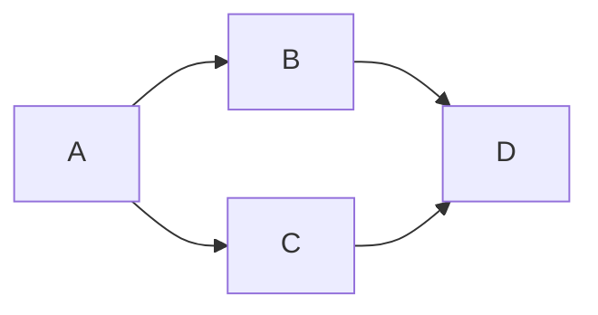
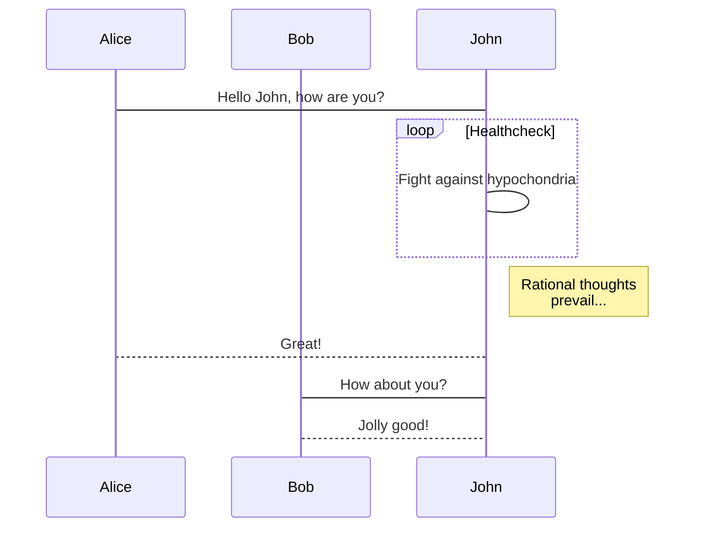
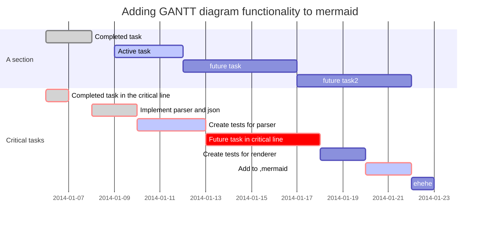
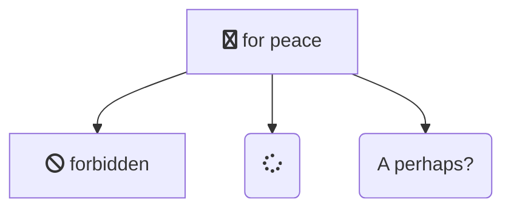
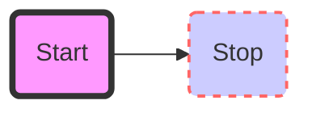
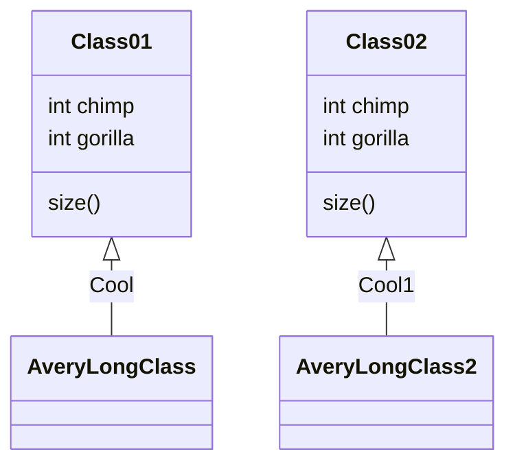

## 1. 图1

```mermaid
graph LR;  
　　A-->B;    
　　A-->C;  
　　B-->D;  
　　C-->D;
```

## 2. 图2

```mermaid
sequenceDiagram
　　　participant Alice
　　　participant Bob
　　　Alice->John:Hello John, how are you?
　　　loop Healthcheck
　　　　　John->John:Fight against hypochondria
　　　end
　　　Note right of John:Rational thoughts <br/>prevail...
　　　John-->Alice:Great!
　　　John->Bob: How about you?
　　　Bob-->John: Jolly good!
```

## 3.  图3

```mermaid
gantt
　　　dateFormat　YYYY-MM-DD
　　　title Adding GANTT diagram functionality to mermaid
　　　section A section
　　　Completed task　　 :done, des1, 2014-01-06,2014-01-08
　　　Active task 　　　　:active, des2, 2014-01-09, 3d
　　　future task 　　　　:　　　  des3, after des2, 5d
　　　future task2　　　　:　　　  des4, after des3, 5d
　　　section Critical tasks
　　　Completed task in the critical line　:crit, done, 2014-01-06,24h
　　　Implement parser and json　　　　　　:crit, done, after des1, 2d
　　　Create tests for parser　　　　　　　:crit, active, 3d
　　　Future task in critical line　　　　　:crit, 5d
　　　Create tests for renderer　　　　　　:2d
　　　Add to ,mermaid　　　　　　　　　　　:crit, active, 2d
　　　ehehe							:1d
```

## 4. 图4

```mermaid
graph TB
      B["fa:fa-twitter for peace"]
      B-->C[fa:fa-ban forbidden]
      B-->D(fa:fa-spinner);
      B-->E("A perhaps?");
```

## 5. 图5

```mermaid
graph LR
     id1(Start)-->id2(Stop)
     style id1 fill:#f9f,stroke:#333,stroke-width:4px;
     style id2 fill:#ccf,stroke:#f66,stroke-width:2px,stroke-dasharray:5,5
```

## 6. 图6

```mermaid
classDiagram
    Class01 <|-- AveryLongClass : Cool
    Class01 : size()
    Class01 : int chimp
    Class01 : int gorilla   
    Class02 <|-- AveryLongClass2 : Cool1
    Class02 : size()
    Class02 : int chimp
    Class02 : int gorilla
```

```mermaid
gitGraph:
options
{
    "nodeSpacing": 150,
    "nodeRadius": 10
}
end
commit
branch newbranch
checkout newbranch
commit
commit
checkout master
commit
commit
merge newbranch
```

